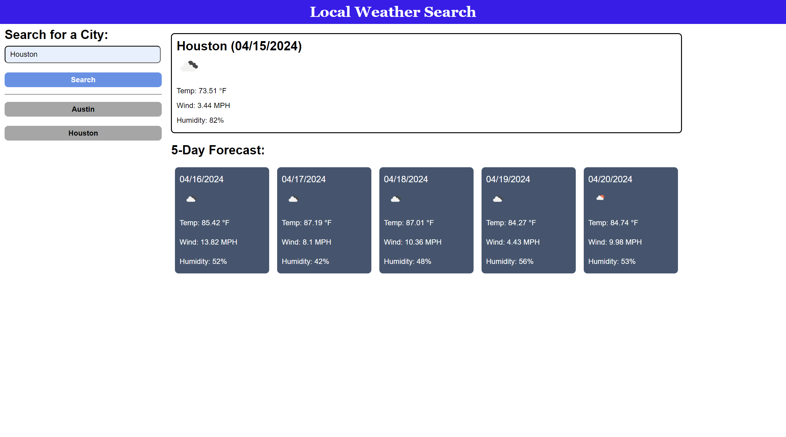

# README

## Description

This repository is made for the purpose of creating a weather dashboard to view current weather and weather for the next 5 days in a given city.

## Visuals

## Usage

Type in a city name to check the weather.  Once a search has been made, shortcut buttons will start appearing for subsequent searches of the same city.  Past searches are stored in local storage

## Technologies Used

HTML 5, CSS 3, Javascript ES6+

## Links

[Page Link](https://jtschams.github.io/weather-dashboard/)

[Repository link (Github)](https://github.com/jtschams/weather-dashboard)

[Author Github Profile](https://github.com/jtschams)

## License

Please refer to LICENSE in repository

## Credits

For Reset CSS: \
http://meyerweb.com/eric/tools/css/reset/ \
v2.0 | 20110126 \
License: none (public domain)

Day.js: \
https://day.js.org/ \
v1.11.3